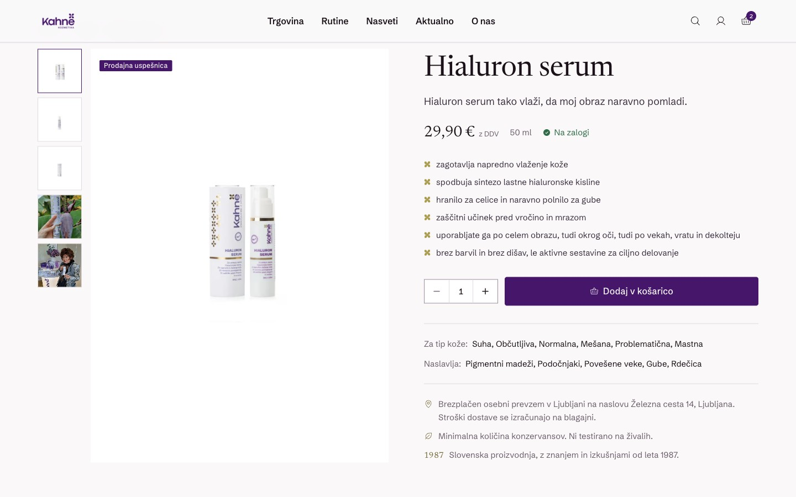
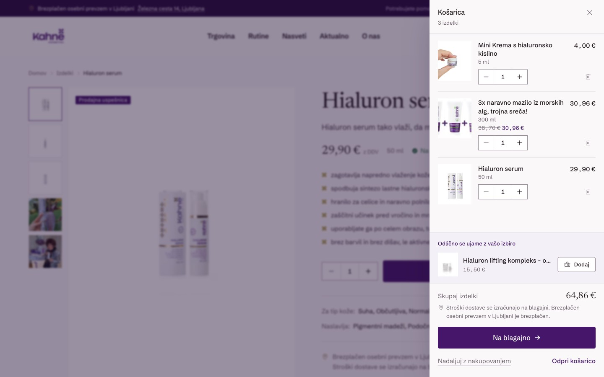
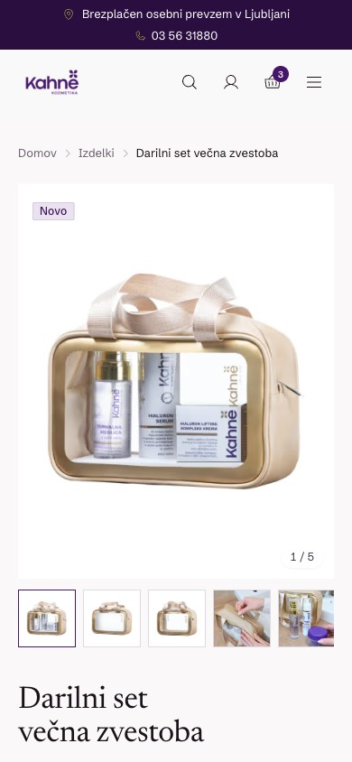

# Kozmetika Kahne — prenova spletne trgovine

Live site → [kozmetika-kahne-prenova.netlify.app](https://kozmetika-kahne-prenova.netlify.app)

A rebuilt storefront for **Kozmetika Kahne**, a Slovenian skincare company founded in 1987.

This is an independent modernisation built as a concept and portfolio piece. The company's live shop at [kozmetikakahne.com](https://kozmetikakahne.com) runs on a separate, closed platform; this repository is a new Next.js front end built against that site as the reference. All content is in Slovenian, and every product, price, ingredient list and review shown here is scraped from the real shop rather than invented.

> **Not affiliated with or endorsed by Kozmetika Kahne d.o.o.** Brand names, product photography and copy remain the property of the company.

---

## Screenshots

### Home


### Shop

The catalogue with server-side filtering. Filter state lives entirely in the URL, so every result is shareable, back-button correct and server-rendered.


### Product



### Routine finder

Four questions mapped onto the catalogue's real skin-type, concern and age tags, returning a four-step routine with a plain-language reason for each pick.


### Cart

Adding to the cart throws the product's photograph on an arc into the header basket, plays a short synthesised chime, then opens the drawer with a confetti burst. All of it yields to `prefers-reduced-motion`.



### Handbook

The company's own 29-page booklet, embedded on the page the original publishes it on.


### Mobile

| Home | Shop | Navigation | Product |
|---|---|---|---|
|  |  |  |  |

---

## What this does that the original didn't

- **Routine finder** (`/rutina`) — four questions onto real catalogue tags, with the reasoning shown.
- **Ingredient index** (`/prirocnik/nega-koze`) — 72 products publish an INCI list on their own page and nowhere else, which answers "what is in this?" but never "which of these contain it?". The index inverts that relation.
- **Usage manual** (`/prirocnik/navodila-za-uporabo`) — the shop's per-product "Namigi za uporabo" notes, collected and searchable.
- **Filtering that survives a reload** — facet counts are computed against every *other* active facet, so a shown count never promises an empty result.
- **A shop view that stays put** — reductions are a scope on the listing rather than a page of their own, so clicking "Znižano" keeps your filters and sort.
- **Mobile** — every journey driven and measured at 430 / 390 / 360 / 320.

Existing live URLs are preserved (`/produkt/{slug}`, `/produkti?category={slug}`, `/akcijska-ponudba`, `/novica/{slug}`, `/prirocnik/{slug}`), and legacy paths without an equivalent are redirected, so nothing that is bookmarked or indexed today would break.

## Stack

Next.js 16 (App Router) · React 19 · TypeScript · Tailwind CSS v4 · Motion · Phosphor Icons

Pages are server components. `components/layout/shell.tsx` is the single client boundary and hydrates only the header, search dialog and cart drawer; interactive pieces below it are isolated leaves.

## Running it

```bash
npm install
npm run dev          # dev server on :3000
npm run build        # production build (also type-checks)
npm run start        # serve the production build
npm run lint
npm run typecheck
```

## Content

The catalogue is not authored here — it is scraped from the live site by the scripts in `scripts/`, which are idempotent and read-only against the source, and their output is committed to `content/`.

```bash
npm run data:catalog   # products.json, categories.json, filters.json
npm run data:images    # downloads + converts new images only
npm run data:banners   # homepage campaign photography
npm run data:content   # articles, advice, CMS pages
```

`lib/products.ts` and `lib/content.ts` are the only modules that read those JSON files, and they are the single source of truth for everything rendered.

## What is real and what is not

Honest by design — see [`INTEGRATIONS.md`](INTEGRATIONS.md) for the full list.

- **Real:** the whole catalogue, prices, reductions, ingredient declarations, articles, expert advice, customer reviews, company details.
- **Stubbed:** checkout takes no payment (`app/api/narocilo/route.ts` validates and recomputes totals server-side, then stops), and the two contact forms validate but send no mail (`app/api/sporocilo/route.ts`). Both say so in the UI rather than pretending.
- **Deliberately absent:** anything the source does not publish. There is no per-product rating data, so none is shown; delivery cost is stated as calculated at checkout, because the shop publishes no figure.

## Further reading

- [`REDESIGN_AUDIT.md`](REDESIGN_AUDIT.md) — what the original does and why things were changed.
- [`INTEGRATIONS.md`](INTEGRATIONS.md) — real versus stubbed, in detail.
- [`CLAUDE.md`](CLAUDE.md) — architecture notes and the constraints that hold it together.
